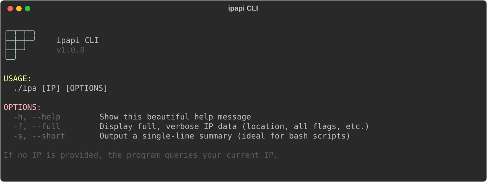
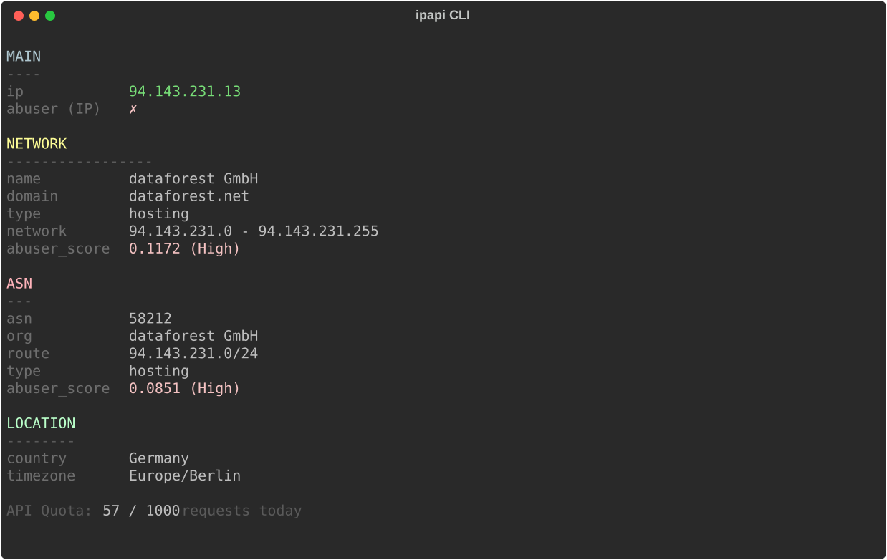
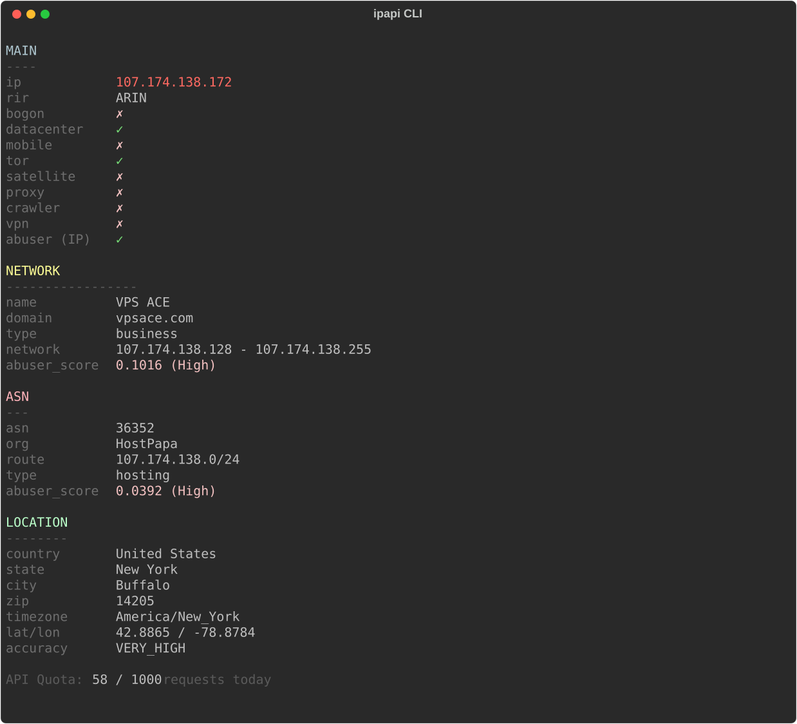

# ipapi CLI 🕸️

Консольная утилита для получения информации об IP-адресах с сервиса [ipapi.is](https://ipapi.is/).

## 🚀 Особенности

- **Молниеносная скорость**: Компилируется в крошечный бинарник. Никаких тяжелых сред выполнения или долгих запусков.
- **Красивый пастельный UI**: Поддержка TrueColor (24-bit RGB) ANSI прямо в терминале.
- **Suckless философия**: Никаких медленных и громоздких конфигурационных файлов — все пресеты захардкожены для максимальной производительности.
- **Анализ угроз (Abuser)**: Цветовое кодирование уровня риска (от безопасного зеленого до критического красного: *Low, Elevated, Medium, High, Severe*).
- **Учет квот API**: Автоматически сохраняет локальный счетчик в оперативной памяти (например, `/tmp/ipa_counter.json`), отслеживая лимит в 1000 бесплатных запросов в день. Нет интернета — лимит не тратится!
- **3 режима отображения**: Обычный (только самое важное), Полный (все данные) и Короткий (в одну строку для парсинга).

## 🐚 Bash-версия (Альтернатива)
Если на сервере нет компилятора C++ — не проблема! В репозитории лежит `ipa.sh`. Это точная копия программы на чистом Bash, которая поддерживает все те же цвета, режимы и счетчики.
*Единственная зависимость для bash-версии:* `jq`

## 🛠️ Установка

**Требования:**
- Компилятор `g++` (с поддержкой C++17)
- `libcurl` (например, пакет `libcurl4-openssl-dev` на Debian/Ubuntu, или `curl` на Arch)

**Сборка и установка:**
```bash
git clone https://github.com/dS0t/ipapi-cli.git
cd ipapi-cli
./build.sh
```

Для установки глобально в систему выполните:
```bash
sudo cp ipa /usr/local/bin/
```

## 💻 Использование и Режимы

Утилита работает в трех идеально сбалансированных режимах. Если запустить ее без указания IP-адреса, она автоматически проверит ваш текущий IP.

### 1. Меню помощи (`-h` или `--help`)
Отображает красивый логотип в виде кибер-паутины и список доступных команд.

```bash
ipa -h
```


---

### 2. Режим по умолчанию (Чистый и минималистичный)
Стандартный режим скрывает визуальный шум (неактивные флаги, излишние координаты геолокации) и дает только самую суть с первого взгляда.

```bash
ipa 8.8.8.8
```


---

### 3. Полный режим (`-f` или `--full`)
Разворачивает абсолютно все данные, полученные от API. Показывает точные координаты, индекс, тип датацентра, флаги мобильных сетей, tor, vpn, ботов и принадлежность к RIR.

```bash
ipa 107.174.138.172 -f
```


---

### 4. Короткий режим (`-s` или `--short`)
Ультимативный режим для написания bash-скриптов или быстрой проверки тысяч IP-адресов. Выдает одну цветную строку. Таблицы и квоты намерено скрыты, чтобы было удобно использовать `grep` или `awk`.

```bash
ipa 1.1.1.1 -s
```


*Формат вывода:* `IP | Код страны | Компания (Тип) | Рейтинг угрозы компании | Рейтинг угрозы ASN`

## 🗂️ Зависимости
- [libcurl](https://curl.se/libcurl/) — для быстрых HTTP-запросов.
- [nlohmann/json](https://github.com/nlohmann/json) — мощный C++ парсер JSON, состоящий из одного файла (уже включен в репозиторий).
